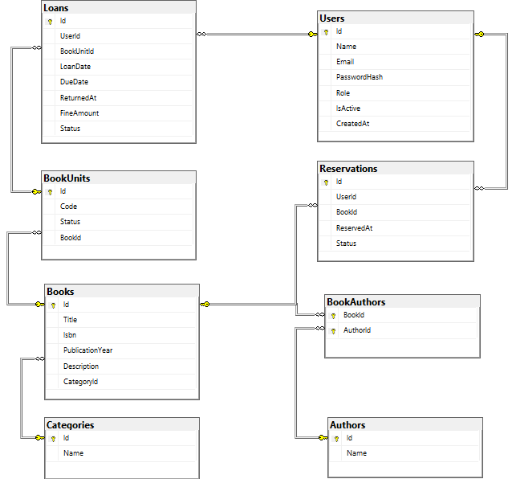

# LibraryOpitech

LibraryOpitech es una API REST para la gestión de una biblioteca. El proyecto permite administrar usuarios, libros, inventario, préstamos, reservas y reportes básicos, usando .NET 8, SQL Server, Entity Framework Core y autenticación JWT.

El proyecto está organizado con Onion Architecture / Clean Architecture, dejando el dominio como centro de la solución y separando las responsabilidades por capas.

## Alcance Del Proyecto

El sistema cubre los puntos principales del reto:

- Gestión de libros: creación, edición, eliminación, consulta, filtros e inventario.
- Gestión de usuarios: creación, edición, eliminación, consulta y perfil propio.
- Autenticación: inicio de sesión con JWT y autorización por roles.
- Préstamos: creación, devolución y cálculo de multa por retraso.
- Reservas: creación y cancelación cuando no hay unidades disponibles.
- Reportes: consulta de libros populares por categoría.

## Arquitectura

La solución sigue una arquitectura Onion. Las capas externas dependen de las internas, pero el dominio no depende de infraestructura, base de datos ni API.

| Capa | Responsabilidad |
| --- | --- |
| Domain | Contiene entidades, enums y reglas base del modelo de negocio. |
| Application | Contiene casos de uso, DTOs, validadores e interfaces. |
| Infrastructure | Implementa acceso a SQL Server, Entity Framework Core, repositorios, UnitOfWork, JWT y hash de contraseñas. |
| Presentation / API | Expone controladores REST, Swagger, autenticación, autorización y middleware global de errores. |

## Diagrama Entidad Relación



## Entidades Principales

| Entidad | Descripción |
| --- | --- |
| User | Representa a una persona que usa el sistema. Tiene nombre, correo, hash de contraseña, rol, estado activo, préstamos y reservas. |
| Book | Representa el libro como obra. Tiene título, ISBN, año de publicación, descripción, categoría, autores y unidades físicas. |
| Author | Representa el autor del libro y se relaciona con Book mediante BookAuthor. |
| Category | Agrupa libros por tema. |
| BookUnit | Representa una unidad física disponible para préstamo. Puede estar Available, Loaned o Unavailable. |
| Loan | Representa el préstamo de una unidad a un usuario. Maneja fecha de préstamo, vencimiento, devolución, multa y estado. |
| Reservation | Representa una reserva de un libro cuando no hay unidades disponibles. |

## Casos De Uso

| Entidad | Caso de uso | Rol |
| --- | --- | --- |
| Autenticación | Iniciar sesión | Sin token |
| Usuarios | Crear usuario | Admin |
| Usuarios | Editar usuario | Admin |
| Usuarios | Eliminar usuario | Admin |
| Usuarios | Listar usuarios | Admin |
| Usuarios | Consultar usuario por id | Admin |
| Usuarios | Ver perfil propio | Admin / User |
| Libros | Crear libro | Admin |
| Libros | Editar libro | Admin |
| Libros | Eliminar libro | Admin |
| Libros | Consultar libros con filtros | Admin / User |
| Libros | Consultar libro por id | Admin / User |
| Libros | Ajustar inventario | Admin |
| Préstamos | Crear préstamo | Admin / User |
| Préstamos | Devolver préstamo | Admin / User |
| Préstamos | Consultar mis préstamos | Admin / User |
| Préstamos | Listar préstamos del sistema | Admin |
| Reservas | Crear reserva | Admin / User |
| Reservas | Cancelar reserva | Admin / User |
| Reservas | Consultar mis reservas | Admin / User |
| Reservas | Listar reservas del sistema | Admin |
| Reportes | Consultar libros populares por categoría | Admin |

## Infraestructura Y Base De Datos

La capa Infrastructure contiene los detalles externos del sistema:

- `LibraryOpitechDbContext`: expone los `DbSet` principales.
- `Configurations`: define relaciones, llaves, índices y restricciones con Fluent API.
- `Repositories`: encapsula consultas y operaciones de persistencia.
- `UnitOfWork`: agrupa repositorios y centraliza `SaveChangesAsync`.
- `DependencyInjection`: registra los servicios de infraestructura.
- Migraciones: la API ejecuta `Database.MigrateAsync()` al iniciar.

### Conexión Local

```text
Server=localhost\SQLEXPRESS;Database=LibraryOpitechDb;Trusted_Connection=True;TrustServerCertificate=True
```

### Conexión Con Docker

| Campo | Valor |
| --- | --- |
| Server | `localhost,14330` |
| User | `sa` |
| Password | `LibraryOpi123*` |
| Database | `LibraryOpitechDb` |
| Trust Server Certificate | Activado |

## Autenticación Y Seguridad

El inicio de sesión se realiza con email y contraseña. Si las credenciales son correctas, la API devuelve un token JWT con datos básicos del usuario y su rol.

- `JwtTokenGenerator`: crea el token con claims de id, nombre, email y rol. El token se firma con HmacSha256.
- `PasswordHasher`: no guarda la contraseña real. Genera un salt aleatorio y deriva una clave con PBKDF2 SHA256.
- Roles: `Admin` administra el sistema y `User` consulta libros, préstamos y reservas propias.
- Middleware global: convierte errores de validación y reglas de negocio en respuestas ordenadas.

## Levantar El Proyecto

Desde la raíz del proyecto:

```powershell
docker compose up --build
```

Para detener los contenedores:

```powershell
docker compose down
```

Para reiniciar también la base de datos:

```powershell
docker compose down -v
docker compose up --build
```

Swagger queda disponible en:

```text
http://localhost:8081/swagger
```

## Flujo Básico En Swagger

1. Abrir `http://localhost:8081/swagger`.
2. Ejecutar `POST /api/Auth/login`.
3. Copiar el token JWT de la respuesta.
4. Dar clic en `Authorize`.
5. Pegar el token.
6. Probar los endpoints según el rol del usuario autenticado.

## Endpoints

### Auth

| Método | Ruta | Rol | Descripción |
| --- | --- | --- | --- |
| POST | `/api/Auth/login` | Sin token | Inicia sesión y devuelve el token JWT. |

### Users

| Método | Ruta | Rol | Descripción |
| --- | --- | --- | --- |
| GET | `/api/Users` | Admin | Lista usuarios de forma paginada. |
| GET | `/api/Users/{id}` | Admin | Consulta un usuario por id. |
| GET | `/api/Users/me` | Admin / User | Consulta el perfil del usuario autenticado. |
| POST | `/api/Users` | Admin | Crea un usuario. |
| PUT | `/api/Users/{id}` | Admin | Actualiza un usuario. |
| DELETE | `/api/Users/{id}` | Admin | Elimina un usuario. |

### Books

| Método | Ruta | Rol | Descripción |
| --- | --- | --- | --- |
| GET | `/api/Books` | Admin / User | Consulta libros con filtros y paginación. |
| GET | `/api/Books/{id}` | Admin / User | Consulta el detalle de un libro. |
| POST | `/api/Books` | Admin | Crea un libro. |
| PUT | `/api/Books/{id}` | Admin | Actualiza un libro. |
| PATCH | `/api/Books/{id}/inventory` | Admin | Ajusta el inventario del libro. |
| DELETE | `/api/Books/{id}` | Admin | Elimina un libro. |

### Loans

| Método | Ruta | Rol | Descripción |
| --- | --- | --- | --- |
| POST | `/api/Loans` | Admin / User | Crea un préstamo tomando una unidad disponible. |
| PATCH | `/api/Loans/{id}/return` | Admin / User | Devuelve un préstamo y calcula multa si hay retraso. |
| GET | `/api/Loans/me` | Admin / User | Consulta los préstamos del usuario autenticado. |
| GET | `/api/Loans` | Admin | Lista préstamos del sistema. |

### Reservations

| Método | Ruta | Rol | Descripción |
| --- | --- | --- | --- |
| POST | `/api/Reservations` | Admin / User | Crea una reserva cuando no hay unidades disponibles. |
| PATCH | `/api/Reservations/{id}/cancel` | Admin / User | Cancela una reserva. |
| GET | `/api/Reservations/me` | Admin / User | Consulta las reservas del usuario autenticado. |
| GET | `/api/Reservations` | Admin | Lista reservas del sistema. |

### Reports

| Método | Ruta | Rol | Descripción |
| --- | --- | --- | --- |
| GET | `/api/Reports/popular-books` | Admin | Devuelve el libro más prestado por categoría. |

## Pruebas

El proyecto incluye pruebas unitarias para la capa Application en `Tests/Application`.

Para ejecutarlas:

```powershell
dotnet test
```

## Estructura General

```text
Core/
  Domain/
  Application/
Infrastructure/
  Infrastructure/
Presentation/
  Api/
Tests/
  Application/
```
